# Chaining Quickstart: Anchoring DGML on NVNM Chain

This guide walks you through anchoring (staking) DGML artifacts on the
**NVNM Chain testnet** from absolute zero — no wallet, no funds, no prior
blockchain experience required.

By the end of these first steps you'll have:

- The MetaMask browser extension installed.
- A wallet (an EVM account).
- The NVNM Chain testnet added as a custom network.
- Test tokens in your wallet, paid for by the faucet.

> **This is a testnet.** The tokens have no real-world value and exist only
> for testing. Never use a wallet that holds real funds for this walkthrough —
> create a fresh one as described below.

**Prerequisites.** This guide focuses on the chain side. It assumes you
already have the `dgml` CLI set up with a workspace, DocSets, and generated
DGML — you'll just pick the file to anchor by its IDs. If you're starting
from scratch on the document side, work through the
[clustering quickstart](../quickstart_clustering.md) first.

NVNM Chain testnet connection details (you'll need these later):

| Field             | Value                                          |
| ----------------- | ---------------------------------------------- |
| Network name      | `NVNM testnet`                                 |
| Chain ID          | `787111`                                        |
| RPC URL           | `https://evm.testnet.nvnmchain.io`             |
| Block explorer    | `https://explorer.evm.testnet.nvnmchain.io/`   |
| Faucet            | `https://faucet.testnet.nvnmchain.io/`         |

---

## 1. Install MetaMask

MetaMask is the wallet we'll use to hold an account and sign transactions.
Go to [metamask.io](https://metamask.io/) and install the browser extension
for your browser (Chrome, Firefox, Brave, Opera, or Edge).

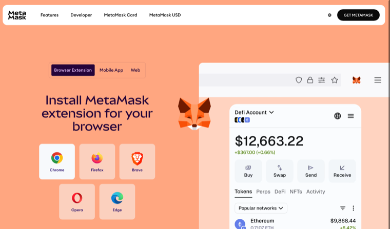

After installing, pin the extension to your toolbar and click its icon to
open it.

## 2. Create a new wallet

When MetaMask opens for the first time, choose **Create a new wallet**.

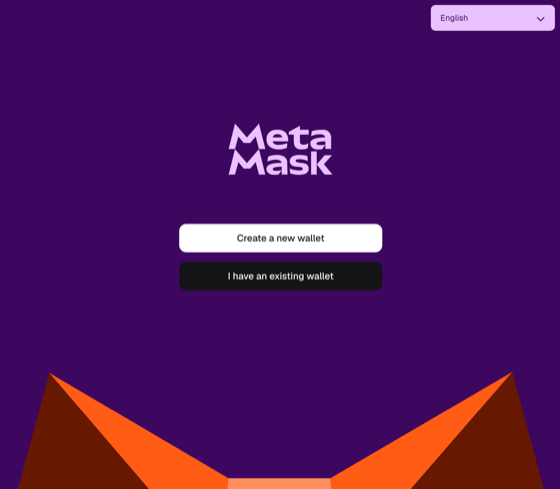

> If you already have a wallet you want to reuse, choose **I have an existing
> wallet** instead — but for this walkthrough we recommend a fresh, throwaway
> testnet wallet.

## 3. Set up your account

MetaMask offers a few ways to back up your account. For a self-custodied
wallet, choose **Use Secret Recovery Phrase** and follow the prompts to write
down and confirm your 12-word phrase.

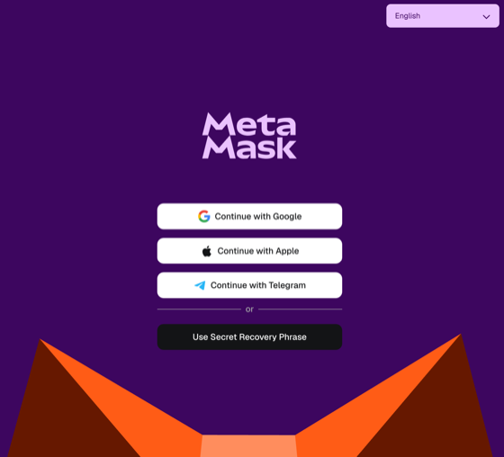

> **Keep your Secret Recovery Phrase private.** Anyone who has it controls
> your wallet. Never share it, screenshot it to the cloud, or paste it into a
> website. For testnet use this matters less, but build the habit now.

Once your wallet is created, MetaMask lands on the home screen prompting you
to **Fund your wallet**. Note the account address shown near the top
(`0x73C16…56AcB` in this example) — that's your EVM address.

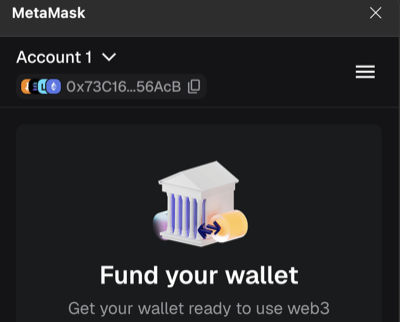

## 4. Add the NVNM Chain testnet

NVNM testnet isn't one of MetaMask's built-in networks, so add it manually.

Open the menu (the **☰** icon in the top-right), then select **Networks**.

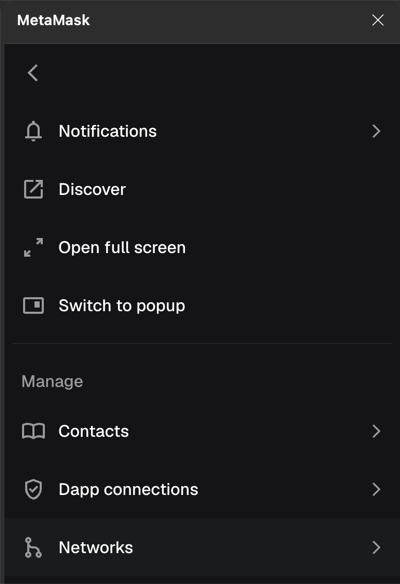

You'll see the default networks (Ethereum, Linea, Base, …). Scroll down and
click **Add a custom network**.

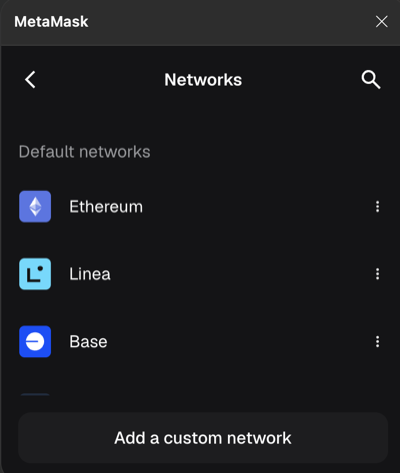

Fill in the NVNM testnet details and click **Save**:

- **Network name:** `NVNM testnet`
- **Default RPC URL:** `https://evm.testnet.nvnmchain.io`
- **Chain ID:** `787111`
- **Currency symbol:** `$`
- **Block explorer URL:** `https://explorer.evm.testnet.nvnmchain.io/`

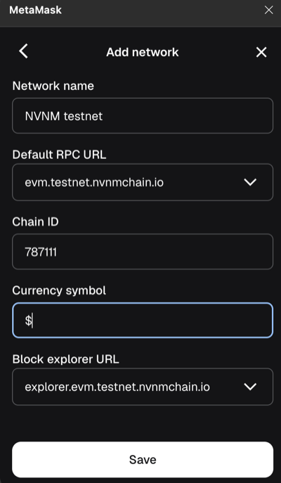

## 5. Copy your EVM address

You'll need your EVM address to receive test tokens. Click the account
address dropdown near the top of the wallet and copy the **Ethereum** address
(it starts with `0x`). This is the address the faucet will fund.

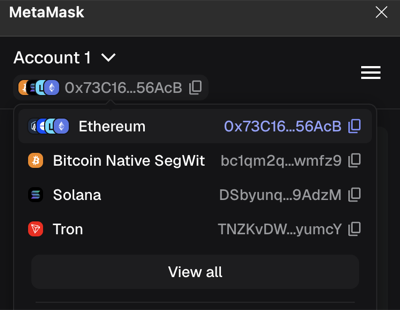

> MetaMask may also show Bitcoin, Solana, and Tron addresses for the same
> account. Ignore those — NVNM Chain is EVM-compatible, so you want the
> `0x…` Ethereum-style address.

## 6. Request test tokens from the faucet

Open the faucet at
[faucet.testnet.nvnmchain.io](https://faucet.testnet.nvnmchain.io/).

Paste your EVM address into **Your EVM address** and click **Request Tokens**.
The faucet dispenses **10 wmantraUSD** per request, rate-limited to one
request per address per 24 hours (and one per IP per hour).

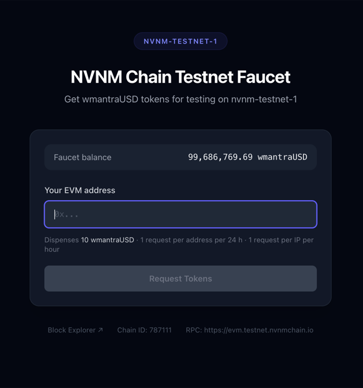

## 7. Confirm your balance

Back in MetaMask, make sure the network selector under **Tokens** is set to
**NVNM testnet**. Within a few seconds you should see your funded balance
(`10 $`) appear.

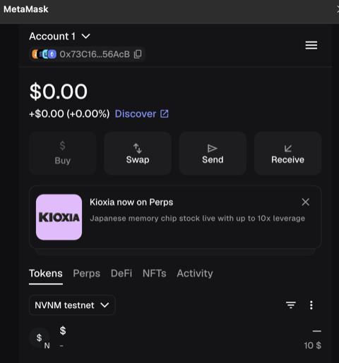

Your wallet is now set up and funded on the NVNM Chain testnet.

## 8. Enable the dgml chain commands

This guide assumes you already use the `dgml` CLI with a workspace, DocSets,
and generated DGML. (If not, start with the
[clustering quickstart](../quickstart_clustering.md) to build a workspace
first.) The on-chain commands (`chain`, `wallet`, `registry`, `stake`,
`prove`) ship in the `chain` extra, so make sure it's installed:

```bash
pip install "dgml[chain]"
```

Sanity-check that the chain commands are available:

```bash
dgml wallet --help
```

If it prints usage rather than a `MISSING_EXTRA` error, you're set.

## 9. Point at your workspace

Run the commands below against your existing workspace. Either export
`DGML_HOME` once:

```bash
export DGML_HOME=/path/to/your/dgml-workspace
```

…or pass `--workspace /path/to/your/dgml-workspace` to each command. Without
either, `dgml` falls back to a `./dgml-workspace` folder in the current
directory.

## 10. Check your wallet on-chain

Now confirm, from the CLI, that the chain sees your funded balance. The
`nvnm-testnet` chain is built in, so no extra configuration is needed. Pass
the EVM address you copied in step 5:

```bash
dgml wallet status --chain nvnm-testnet --address 0xYourEvmAddress
```

This is a **read-only** query — it inspects any address you name and needs no
private key. You'll get back JSON like:

```json
{
  "chain": "nvnm-testnet",
  "address": "0x73C16…56AcB",
  "balance_wei": "10000000000000000000",
  "balance_eth": "10",
  "native_token": "wmantraUSD",
  "nonce": 0,
  "funded": true
}
```

`"funded": true` (and a non-zero `balance_eth`) confirms the faucet tokens
landed and your wallet is ready to pay gas for anchoring. A zero balance with
`"funded": false` means the faucet transfer hasn't arrived yet — wait a few
seconds and re-run, or revisit step 6.

> Omitting `--address` makes `dgml wallet status` default to the address
> controlled by your signing key in the OS keyring. We haven't set that key
> up yet (it's needed only to *send* transactions, not to check a balance) —
> that's the next step.

## 11. Export your private key from MetaMask

To *send* transactions (creating a registry, anchoring artifacts), the `dgml`
CLI needs to sign them with your account's **private key**. You'll export it
from MetaMask once and store it in your operating system's keyring (next
step) — the CLI reads it only at signing time and never prints it.

> **⚠️ Your private key grants full control of the account.** Anyone who has
> it can move every asset on every chain for that address. Only do this for a
> throwaway *testnet* wallet, never one holding real funds. Never paste it
> into a website, commit it to a repo, or share it.

Open MetaMask and click the account name at the top to open the **Accounts**
list. Click the **⋮** (three dots) next to your account.

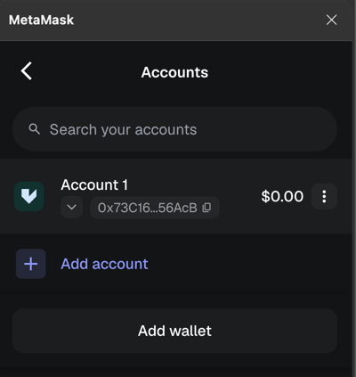

On the account details screen, select **Private keys** (**Unlock to reveal**).

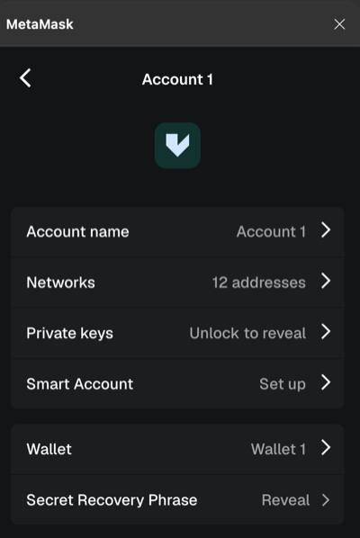

Enter your MetaMask password and click **Confirm**.

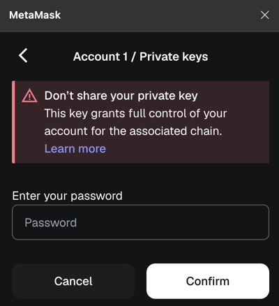

> **Copy the Ethereum private key.** This MetaMask account holds keys for
> several chains (Ethereum, Bitcoin, Solana, Tron, …). NVNM Chain is
> EVM-compatible, so you need the **Ethereum** key — the one for the `0x…`
> address you funded in step 6, **not** the Bitcoin, Solana, or Tron key.
> Make sure **Ethereum** is selected before you copy.

The Ethereum private key is a 64-character hex string (it may be shown with
or without a `0x` prefix; either works). Copy it — you'll paste it into the
keyring next.

## 12. Store the key in your OS keyring

`dgml[chain]` ships the [`keyring`](https://pypi.org/project/keyring/) tool,
which writes secrets to your platform's native, encrypted credential store —
**macOS Keychain**, **Windows Credential Manager**, or the **Linux Secret
Service** (GNOME Keyring / KWallet). The `dgml` CLI reads the key from there
by service name `nvnm-wallet`, account `default`.

Store your key with the cross-platform `keyring` command. It prompts for the
value and reads it **without echoing**, so the key never lands in your shell
history:

```bash
keyring set nvnm-wallet default
# Password for 'default' in 'nvnm-wallet':  ← paste the private key, press Enter
```

That single command works on all three platforms. Platform-specific notes:

- **macOS** — stored in the login Keychain via the Keychain backend; no setup
  needed. (If you've ever forced the `fail` backend in a `keyringrc.cfg`,
  remove that override — `dgml` selects the macOS Keychain backend directly,
  but the `keyring set` CLI honors the config file.)
- **Windows** — stored in Windows Credential Manager via the built-in
  backend; no setup needed. Works in PowerShell and `cmd`.
- **Linux** — uses the Secret Service API, which needs a running secret
  service (GNOME Keyring or KWallet) and the `SecretStorage`/`dbus` libraries.
  On a desktop this is already present. On a **headless server** there may be
  no Secret Service; either run inside `dbus-run-session -- keyring set
  nvnm-wallet default` with an unlocked keyring, or install an alternative
  backend (e.g. `pip install keyrings.alt`) and select it. See the
  [keyring docs](https://keyring.readthedocs.io/) for headless setups.

> Prefer not to use a keyring at all? You can also override the service and
> account names with the `NVNM_KEY_SERVICE` / `NVNM_KEY_ACCOUNT` environment
> variables if you keep keys under different names.

Verify the CLI now controls the right account. Run `wallet status` **without**
`--address` — it defaults to the keyring key's address:

```bash
dgml wallet status --chain nvnm-testnet
```

The `address` in the output must match the EVM address you funded in step 6.
If it does, the CLI can sign transactions as your wallet and you're ready to
anchor.

> If you get a `WALLET_KEY_MISSING` error later, the key isn't in the keyring
> under the expected service/account, or it controls a different address than
> the `--from` you passed — re-run `keyring set` and re-check this step.

---

## 13. Choose the document to anchor

You'll anchor a file that already has generated DGML in your workspace. The
chain never stores the document itself — only a hash of it — so all you need
here are the **DocSet ID** and **file ID** of what you want to anchor.

List your DocSets and pick the one you want:

```bash
dgml docset list
```

Set its ID, then list the files assigned to it and pick one:

```bash
ds=<docset_id>
dgml docset list-files "$ds"
```

```bash
fid=<file_id>
```

> The file must already have generated DGML for this DocSet — i.e.
> `docsets/<docset_id>/files/<file_id>/<stem>.dgml.xml` exists (run
> `dgml docset generate "$ds"` if not). That file, plus the source document,
> page images, and the DocSet schema, is what gets hashed into the anchor.

## 14. Create a registry

An anchored record lives inside a **registry** — a named collection on the
chain. Create one (the creator becomes its admin):

```bash
dgml registry create --chain nvnm-testnet \
  --name "my-hello-registry" \
  --description "DGML chaining hello world"
```

This builds, signs, and **broadcasts** a transaction (it spends gas from your
funded wallet), waits for the receipt, and returns `{registry, from,
tx_hash, receipt_status, block_number, explorer_url}`. Open the
`explorer_url` to see it on the block explorer.

> The registry **name must be unique on the chain** — if `registry create`
> reverts (`CHAIN_TX_REVERTED`), the name may be taken; pick another.
> Add `--dry-run` to any write command to build and sign it *without*
> broadcasting, so you can inspect the transaction before spending gas.

## 15. Anchor (stake) the document

Anchor the whole file bundle. Its checksum is a Merkle root over the source
PDF, page images, schema, and the generated DGML XML — change any of them and
the checksum changes.

```bash
dgml stake file "$fid" --docset "$ds" \
  --chain nvnm-testnet --registry "my-hello-registry"
```

One command exports the bundle, anchors its Merkle root under the URI
`dgmlx://<file_id>/<docset_id>`, broadcasts, awaits the receipt, then fetches
and **saves the record** to `record.json` in the output directory. By default
the bundle is written there as a single portable `<stem>.dgmlx` archive (its
path in the payload's `dgmlx`); pass `--unpacked` to write the loose bundle
tree instead. The result JSON carries `checksum`, `uri`, `tx_hash`,
`receipt_status`, `record_path`, and `explorer_url`. Keep the `record.json` —
proving works from it offline.

> `stake` signs with your keyring key and defaults `--from` to that key's
> address (the wallet you funded). It refuses to sign if the key doesn't
> control `--from`.

### Anchor a single node (optional)

You can also anchor just **one element** of the DGML XML — proving that node
belongs to the document without revealing the rest. Identify the element by
its `--xpath` (copy it from the DGML viewer's tree, or read it out of the
`<stem>.dgml.xml` file) or by its `--leaf <n>` index:

```bash
dgml stake node "$fid" --docset "$ds" \
  --xpath '/dg:chunk/docset:Entry[2]/docset:Amount' \
  --chain nvnm-testnet --registry "my-hello-registry"
```

The record checksum is the node's hash; the metadata carries the document's
Merkle root plus the inclusion proof. The URI gains a `#<leaf>` fragment, and
the record saves as `record-node-<leaf>.json`.

## 16. Verify (prove) the anchored record

Proving re-derives the hash from your workspace and checks it against what's
on the chain. Prove from the saved record file (no chain lookup needed):

```bash
dgml prove file --chain nvnm-testnet --record-json record.json
```

Or look the record up on-chain by its checksum:

```bash
dgml prove file --chain nvnm-testnet \
  --registry "my-hello-registry" --checksum <checksum-from-step-15>
```

Exit code **0** with `"valid": true` means the document matches the anchor.
A mismatch exits **2** with `"valid": false` — that means the workspace
artifacts no longer hash to the anchored checksum (the document, schema, or
DGML changed since you staked). Use `prove node` for a node record.

> Re-running generation, re-grounding, or adding artifacts changes the
> Merkle root, so the old record stops proving against the workspace **by
> design**. When that's intended, stake again — re-anchoring the same
> `(registry, record)` adds a new version rather than replacing the old one.

---

## You've anchored DGML on-chain 🎉

End to end, you went from nothing to a verifiable on-chain anchor:

1. Installed MetaMask and created a wallet (steps 1–3).
2. Added the NVNM Chain testnet and funded the wallet from the faucet
   (steps 4–7).
3. Installed the `dgml` CLI, made a workspace, and verified the balance
   on-chain (steps 8–10).
4. Exported your private key and stored it in the OS keyring (steps 11–12).
5. Chose a DGML document, created a registry, anchored it, and proved it
   (steps 13–16).

From here, explore the [CLI reference](../cli-reference.md) for the full
document pipeline and the `chain`, `registry`, `stake`, and `prove` command
surfaces.
