# Choosing a clustering scenario

DGML clustering has five scenarios (**S1–S5**), from unsupervised to fully-supervised.
You almost never pick one by name — it's derived from what you already know about
your documents. This page gets you to the right one fast, then explains the *why*
below the fold.

> This page is for when you already have some structure to build on — category
> names, labeled examples, or existing DocSets. If you have none of that and simply
> want to group a folder of PDFs from scratch, you don't need it: run `dgml cluster`
> (see [quickstart-clustering.md](quickstart-clustering.md)).

## 1. Find your scenario

```mermaid
flowchart TD
    Q1{"Do you have category NAMES?<br/>&#40;e.g. Invoice, Contract, Loss Run&#41;"}
    Q1 -->|"No — I know nothing<br/>about the categories"| S1["S1 · Unsupervised<br/>Discover the clusters from scratch,<br/>then name them afterwards"]
    Q1 -->|"Yes, some — and NEW<br/>categories may still appear"| Q2{"Do you also have labeled<br/>EXAMPLES for each category?<br/>&#40;already-sorted docs&#41;"}
    Q1 -->|"Yes, ALL of them — and the<br/>set is FIXED &#40;no new ones&#41;"| Q3{"Do you also have labeled<br/>EXAMPLES for each category?"}

    Q2 -->|"No, names only"| S2["S2 · Assign by category NAME<br/>Docs too far from any name →<br/>emergent 'unknown_*' cluster"]
    Q2 -->|"Yes, a few per category"| S3["S3 · Assign by few-shot EXAMPLES<br/>Docs too far from any →<br/>emergent 'unknown_*' cluster"]
    Q3 -->|"No, names only"| S4["S4 · Zero-shot<br/>Force EVERY doc into one<br/>of the named categories"]
    Q3 -->|"Yes, a few per category"| S5["S5 · Full-supervised<br/>Force every doc into a category<br/>using its labeled examples"]

    S1 -.-> OPEN(["OPEN set — new categories can emerge<br/>Run with: dgml cluster"])
    S2 -.-> OPEN
    S3 -.-> OPEN
    S4 -.-> CLOSED(["CLOSED set — every doc gets a known label<br/>Run with: run_clustering&#40;all_categories_known=True&#41;"])
    S5 -.-> CLOSED

    style S1 fill:#e8d6ff,stroke:#7b2ff7,color:#111
    style S5 fill:#d6f5d6,stroke:#2e8b57,color:#111
    style OPEN fill:#cfe8ff,stroke:#1c74d4,color:#111
    style CLOSED fill:#ffe8b3,stroke:#e69500,color:#111
```



**One rule of thumb:** examples beat names when you have them (S3 > S2, S5 > S4).

## Concrete situations — which one is you?

**S1 — "What's even in here?"**
A law firm hands you 2,000 scanned files from a closed case. Nobody has sorted them,
and you don't know what kinds of documents are inside or how many kinds there are.
Run S1 to let the groups form on their own (leases, non-disclosure agreements,
letters, invoices, and so on), then have someone give each group a name. *Pick S1
whenever you're exploring an unknown pile and starting from nothing.*

**S2 — "I know my document types, but I haven't sorted any yet."**
Your billing team keeps receiving the same few document types — invoices, purchase
orders, payment notices — but hasn't set aside any sorted examples. A new set of
supplier documents comes in, and you expect the occasional one that doesn't belong
(a contract, a legal notice). S2 sends each document to the closest matching *name*,
and puts anything that matches none into a separate "unknown" pile for a person to
review. *You have the names, no examples, and you're fine with a leftover pile.*

**S3 — "I've been sorting these for a while, and new types still show up."**
You've spent a month sorting mortgage documents and now have about ten sorted
examples each of appraisals, credit agreements, and rent rolls (three groups). A new
set arrives: you want the familiar documents sent into those three groups, but a
genuinely new type — say a capital-call notice you've never handled — should start
its *own* group instead of being wrongly filed under the closest match. That's S3.
*You have examples for the types you know, and room for the ones you don't.*

**S4 — "Every document has to be one of a fixed set — no exceptions."**
A claims system has to label every incoming document as exactly one of four types:
claim, policy, endorsement, or letter. There is no "other" — every document must go
somewhere. You have the four names but no sorted examples. S4 sends each document to
its closest matching name. *A fixed set of types, names only, nothing left unlabeled.*

**S5 — "Same fixed set, but I want the best accuracy I can get."**
Same as S4, except you've now hand-picked about eight checked examples for each type.
You still want every document placed into one of the fixed types with nothing left
over, but as accurately as possible. S5 learns each type from its examples rather
than just its name, which gives the most reliable result. *A fixed set of types plus
examples — the most dependable sorting.*

## 2. Run it

Two surfaces, split by the tree's last row: **open set** (new categories may emerge)
uses the CLI; **closed set** (fixed taxonomy) uses the library.

### Open set → `dgml cluster` (S1 / S2 / S3)

```bash
# S1 — cluster everything from scratch (no existing DocSets, or force it).
dgml cluster --mode fresh

# S2 / S3 — existing DocSets ARE the known categories. Their members become
# few-shot prototypes (S3); a DocSet with no usable members falls back to
# name-only prototypes (S2). New files that fit join the DocSet; the rest form
# emergent clusters, each named into a new DocSet.
dgml cluster --mode incremental

# auto (default) — incremental if the workspace has DocSets, else fresh.
dgml cluster
```

### Closed set → library (S4 / S5)

Every document is forced into a named category; no `unknown_*` bucket. Exposed
through the `dgml_core.run_clustering` *module* (it is not re-exported from
`dgml_core`'s top level), not a CLI mode:

```python
from pathlib import Path

from dgml_core.dataset import WorkspaceFileDataset
from dgml_core.run_clustering import resolve_text_settings, run_clustering
from dgml_core.storage import Workspace

CATEGORIES = ["Invoice", "Contract", "Loss Run"]
root = Path("my-workspace")

# The bundled default text encoder is corpus-fitted TF-IDF: it has to see the
# whole corpus once to learn document frequencies, and the dataset has to
# assemble `record.text` under the same text view the encoder fits on.
# resolve_text_settings derives both from the config — skip it and the run
# fails with "tfidf encoder requires cfg.extra['corpus_dir']".
# The argument is a DGML workspace's `files/` dir: what gets read is the
# per-file `page_images/` and `page_text/` that `dgml file add` wrote, so this
# is not a flat folder of PDFs.
text_view, overrides = resolve_text_settings(root / "files", None)

workspace = Workspace(root=root)
# `text_view` is the reason to keep the returned value: pass it through, or the
# dataset assembles text the encoder was not fitted on.
dataset = WorkspaceFileDataset(workspace, to_classify_ids, text_view=text_view)

# S4 — all category names, no labeled examples.
labels = run_clustering(
    dataset,
    known_categories=CATEGORIES,
    all_categories_known=True,        # closed set → no emergent clusters
    overrides=overrides,
)

# S5 — you also have labeled examples. The support dataset is the same class
# with a {file_id: category} map, and every category needs at least one.
support = WorkspaceFileDataset(
    workspace, list(labeled_ids), labeled_ids, text_view=text_view
)
labels = run_clustering(
    dataset,
    known_categories=CATEGORIES,
    all_categories_known=True,
    n_samples_per_category=8,
    support_dataset=support,
    overrides=overrides,
)
```

`to_classify_ids` and `labeled_ids` are yours to supply — file IDs from
`dgml file list`, and a `{file_id: category}` map whose values are drawn from
`CATEGORIES`. Filter out any file whose `page_images/` is missing before passing
it in: the dataset raises on a file it cannot render.

`n_samples_per_category` is a **cap**, not a requirement: each category's
prototype averages at most that many of its labeled examples (in dataset order),
so a category with fewer is fine — but one with *none* raises. It has no
scenario-aware default here — `run_clustering` defaults it to `0`, which is what
selects S4 over S5 — so pass it explicitly. 8 is a reasonable starting point.

Two things to know if you swap the text encoder
(`overrides={"encoder_text": {...}}`):

- **Match `manifold.dim` to the new `embedding_dim`.** With the bundled defaults
  (`fusion.name: none`, `training.identity_projector: true`) the projector is a
  parameter-free passthrough, so it requires `fusion.output_dim == manifold.dim`
  and rejects a mismatch rather than adapting it. See the tuning section of
  [quickstart-clustering.md](quickstart-clustering.md).
- **For S4 specifically, consider not using the default encoder.** S4's
  prototypes are the encoded category *names* (`"a scanned document of category:
  {category}"`), and the bundled TF-IDF encoder only knows words it saw in your
  corpus — and it drops rare terms (`min_df=2`) — so a category name outside that
  vocabulary contributes nothing to its prototype. Measured on a 265-document
  workspace: neither `invoice` nor `contract` made the fitted vocabulary, both
  prompts collapsed onto the words they share, and the two prototypes came out
  *identical* (cosine 1.0000) — which makes the choice between those categories a
  tie-break rather than a measurement. A pretrained sentence encoder
  (`st_minilm`, `e5`, …) embeds the names on their own terms and doesn't have this
  failure mode. S5 is unaffected: its prototypes come from documents, not names.

That's enough to run any scenario. **The rest of this page is background** — read on
only if you want the reasoning, the exact inputs, or tuning knobs.

---

## The three questions (what the tree encodes)

1. **Do you have category *names*?** (e.g. `Invoice`, `Contract`, `Loss Run`)
2. **Do you have labeled *examples* per category?** — documents you've already
   sorted. In DGML, the members of an existing DocSet count.
3. **May *new* categories emerge**, or must every document be forced into one of
   the categories you named? (open set vs closed set)

The engine derives the scenario from three arguments — `known_categories`,
`all_categories_known`, and `n_samples_per_category` — so a caller can never pin a
scenario that contradicts its inputs (see `dgml_core.run_clustering.run_clustering`).

## Decision matrix (the tree as a table)

| Category names | Labeled examples | New categories? | Scenario | What it does |
|---|---|---|---|---|
| none | – | yes | **S1** | Unsupervised: discover clusters from scratch |
| some | no | yes | **S2** | Assign by name; outliers → emergent `unknown_*` |
| some | yes | yes | **S3** | Assign by few-shot example prototypes; outliers → `unknown_*` |
| all | no | no (closed) | **S4** | Zero-shot: force every doc into a named category |
| all | yes | no (closed) | **S5** | Full-supervised: force every doc in via example prototypes |

## Trade-offs (open vs closed)

| | Open set (S1/S2/S3) | Closed set (S4/S5) |
|---|---|---|
| New categories | can emerge (`unknown_*`) | never |
| Every doc labeled | no (some → `unknown_*`) | yes, always |
| Surface | `dgml cluster` CLI | `run_clustering(..., all_categories_known=True)` |
| Best when | taxonomy is still growing | taxonomy is fixed (triage / routing) |

A closed set trades the ability to discover new types for a guaranteed answer on
every document — pick it for routing/triage, not for exploring an unknown corpus.

## Notes & further tuning

- **Incremental novelty gate:** `--mode incremental` ships a conservative gate so
  genuinely new document types open a new DocSet instead of being forced into the
  nearest existing one. See [incremental-clustering.md](incremental-clustering.md).
- **Very small fresh corpora (≤ 8 files):** embeddings have too little signal — the
  default `--method auto` routes to a one-shot vision-LLM partitioner instead. Incremental
  runs keep the embedding path at any batch size. See the "Only a handful of documents?"
  section of the quickstart.
- **Building a `DocumentDataset` / `support_dataset`:** for documents already in a
  DGML workspace, `dgml_core.dataset.WorkspaceFileDataset` is the one to use — it
  reads the page renders and page text `dgml file add` produced. Only write your
  own (see [`packages/clustering/README.md`](../packages/clustering/README.md))
  for documents that live outside a workspace, and note that the example there
  sets `text=""`: fine for an image-only run, but a text encoder needs real text
  in every record.
- **Per-parameter tuning** (encoders, reduction, Leiden/HDBSCAN, the novelty gate,
  compute presets): the "Tune the clustering" section of
  [quickstart-clustering.md](quickstart-clustering.md) and
  [cli-reference.md](cli-reference.md).
